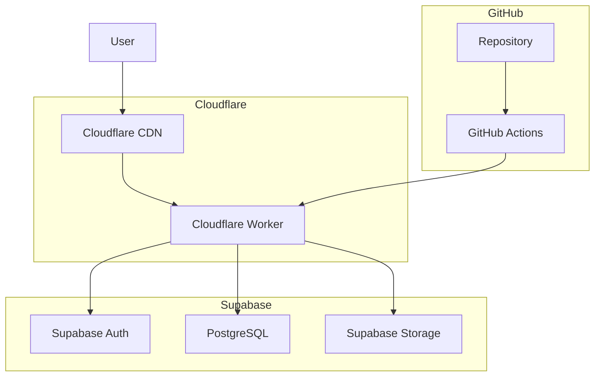
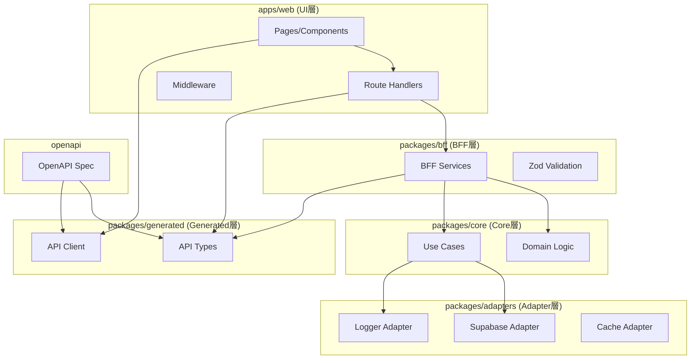
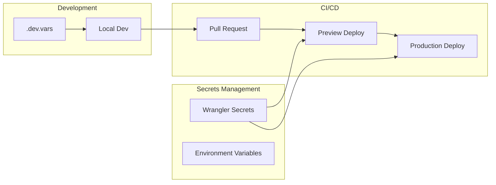

# 設計文書

## 概要

本設計文書は、Next.js（App Router）をOpenNextでビルドし、Cloudflare Workers上で動作するWebアプリケーション開発用のプロジェクトテンプレートの技術設計を定義します。Supabase（Auth + Postgres + Storage）をバックエンドの中核とし、OpenAPI定義から型安全なAPIを生成する契約駆動開発を採用します。

段階的開発により、フェーズ1でヘルスチェック機能、フェーズ2で認証機能を実装し、将来的なバックエンド分離やプラットフォーム移行に対応できる柔軟なアーキテクチャを構築します。

## アーキテクチャ

### システム全体構成



### 論理層構成



### デプロイメント構成



## コンポーネントとインターフェース

### 1. UI層（apps/web）

#### Pages構成

- `/` - トップページ（ログインボタン）
- `/home` - 認証必須ホーム（ヘルスチェックボタン）
- `/health` - SSRヘルスチェック表示
- `/auth/login` - ログイン処理
- `/auth/callback` - OAuth コールバック
- `/auth/logout` - ログアウト処理

#### Route Handlers

```typescript
// /api/health/route.ts
export async function GET() {
  const result = await healthService.checkHealth();
  return Response.json(result);
}
```

#### Middleware

```typescript
// middleware.ts
export async function middleware(request: NextRequest) {
  const { supabase, response } = createServerClient(request);
  const {
    data: { session },
  } = await supabase.auth.getSession();

  if (!session && request.nextUrl.pathname.startsWith('/home')) {
    return NextResponse.redirect(new URL('/', request.url));
  }

  return response;
}
```

### 2. BFF層（packages/bff）

#### Health Service

```typescript
export class HealthService {
  constructor(
    private coreHealthService: CoreHealthService,
    private logger: Logger
  ) {}

  async checkHealth(): Promise<HealthResponse> {
    const traceId = generateTraceId();
    this.logger.info({ traceId }, 'Health check started');

    try {
      const result = await this.coreHealthService.performHealthCheck();
      return this.mapToApiResponse(result);
    } catch (error) {
      this.logger.error({ traceId, error }, 'Health check failed');
      throw error;
    }
  }
}
```

#### Auth Service

```typescript
export class AuthService {
  constructor(
    private supabaseAdapter: SupabaseAdapter,
    private logger: Logger
  ) {}

  async handleLogin(provider: string): Promise<AuthResponse> {
    return this.supabaseAdapter.signInWithOAuth({ provider });
  }

  async handleCallback(code: string): Promise<SessionResponse> {
    return this.supabaseAdapter.exchangeCodeForSession(code);
  }
}
```

### 3. Core層（packages/core）

#### Domain Models

```typescript
export interface HealthStatus {
  status: 'healthy' | 'degraded' | 'unhealthy';
  timestamp: Date;
  services: ServiceHealth[];
}

export interface ServiceHealth {
  name: string;
  status: 'up' | 'down';
  responseTime?: number;
  error?: string;
}
```

#### Use Cases

```typescript
export class CoreHealthService {
  constructor(
    private adapters: {
      supabase: SupabaseAdapter;
      logger: Logger;
    }
  ) {}

  async performHealthCheck(): Promise<HealthStatus> {
    const services: ServiceHealth[] = [];

    // Supabase接続チェック
    if (this.shouldCheckSupabase()) {
      const supabaseHealth = await this.checkSupabaseHealth();
      services.push(supabaseHealth);
    }

    return {
      status: this.determineOverallStatus(services),
      timestamp: new Date(),
      services,
    };
  }
}
```

### 4. Adapter層（packages/adapters）

#### Supabase Adapter

```typescript
export class SupabaseAdapter {
  private client: SupabaseClient;

  constructor(config: SupabaseConfig) {
    this.client = createClient(config.url, config.anonKey);
  }

  async checkConnection(): Promise<boolean> {
    try {
      const { error } = await this.client
        .from('health_check')
        .select('1')
        .limit(1);
      return !error;
    } catch {
      return false;
    }
  }

  async signInWithOAuth(params: OAuthParams): Promise<AuthResponse> {
    return this.client.auth.signInWithOAuth(params);
  }
}
```

#### Logger Adapter

```typescript
export class LoggerAdapter {
  private pino: pino.Logger;

  constructor(config: LoggerConfig) {
    this.pino = pino({
      level: config.level,
      transport: config.isDevelopment
        ? {
            target: 'pino-pretty',
          }
        : undefined,
      redact: ['password', 'token', 'secret'],
    });
  }

  info(obj: any, msg?: string) {
    this.pino.info(obj, msg);
  }

  error(obj: any, msg?: string) {
    this.pino.error(obj, msg);
  }
}
```

### 5. Generated層（packages/generated）

#### API Types（openapi-typescript生成）

```typescript
export interface HealthResponse {
  status: 'healthy' | 'degraded' | 'unhealthy';
  timestamp: string;
  services: ServiceHealth[];
}

export interface AuthResponse {
  data: {
    url: string;
  };
  error: null | AuthError;
}
```

#### API Client（orval生成）

```typescript
export const healthApi = {
  getHealth: (): Promise<HealthResponse> => {
    return fetch('/api/health').then(res => res.json());
  },
};

export const authApi = {
  login: (provider: string): Promise<AuthResponse> => {
    return fetch(`/auth/login?provider=${provider}`, {
      method: 'POST',
    }).then(res => res.json());
  },
};
```

## データモデル

### OpenAPI Schema定義

```yaml
# openapi/openapi.yaml
openapi: 3.0.3
info:
  title: Template Beta API
  version: 1.0.0

components:
  schemas:
    HealthResponse:
      type: object
      required:
        - status
        - timestamp
        - services
      properties:
        status:
          type: string
          enum: [healthy, degraded, unhealthy]
        timestamp:
          type: string
          format: date-time
        services:
          type: array
          items:
            $ref: '#/components/schemas/ServiceHealth'

    ServiceHealth:
      type: object
      required:
        - name
        - status
      properties:
        name:
          type: string
        status:
          type: string
          enum: [up, down]
        responseTime:
          type: number
        error:
          type: string

paths:
  /api/health:
    get:
      summary: Get system health status
      responses:
        '200':
          description: Health status
          content:
            application/json:
              schema:
                $ref: '#/components/schemas/HealthResponse'
```

### Zod Validation Schema

```typescript
import { z } from 'zod';

export const HealthResponseSchema = z.object({
  status: z.enum(['healthy', 'degraded', 'unhealthy']),
  timestamp: z.string().datetime(),
  services: z.array(
    z.object({
      name: z.string(),
      status: z.enum(['up', 'down']),
      responseTime: z.number().optional(),
      error: z.string().optional(),
    })
  ),
});

export type HealthResponse = z.infer<typeof HealthResponseSchema>;
```

## エラーハンドリング

### エラー分類と処理戦略

#### 1. システムエラー（5xx）

- **Supabase接続エラー**: フォールバック応答、アラート送信
- **内部処理エラー**: ログ記録、汎用エラーレスポンス
- **タイムアウトエラー**: リトライ機構、デグレード状態

#### 2. クライアントエラー（4xx）

- **認証エラー**: ログインページリダイレクト
- **認可エラー**: 403エラーページ表示
- **バリデーションエラー**: 詳細エラーメッセージ

#### 3. ネットワークエラー

- **接続エラー**: 再試行制御、オフライン表示
- **レスポンス遅延**: Loading状態、タイムアウト処理

### エラーハンドリング実装

```typescript
// packages/bff/error-handler.ts
export class ErrorHandler {
  static handle(error: unknown, context: ErrorContext): ErrorResponse {
    const traceId = context.traceId;

    if (error instanceof ValidationError) {
      return {
        status: 422,
        body: { error: 'Validation failed', details: error.details, traceId },
      };
    }

    if (error instanceof AuthenticationError) {
      return {
        status: 401,
        body: { error: 'Authentication required', traceId },
      };
    }

    // システムエラー
    logger.error({ error, traceId }, 'Unhandled error');
    return {
      status: 500,
      body: { error: 'Internal server error', traceId },
    };
  }
}
```

### フロントエンドエラーハンドリング

```typescript
// apps/web/lib/error-boundary.tsx
export function ErrorBoundary({ children }: { children: React.ReactNode }) {
  return (
    <ErrorBoundaryComponent
      fallback={({ error, retry }) => (
        <div className="error-container">
          <h2>エラーが発生しました</h2>
          <p>{error.message}</p>
          <button onClick={retry}>再試行</button>
        </div>
      )}
    >
      {children}
    </ErrorBoundaryComponent>
  );
}
```

## テスト戦略

### テスト構成

#### 1. 単体テスト（Vitest）

- **Core層**: ビジネスロジックの単体テスト
- **BFF層**: サービス層のテスト
- **Adapter層**: 外部依存のモックテスト

#### 2. 統合テスト

- **API契約テスト**: OpenAPI仕様との整合性
- **認証フローテスト**: Supabase認証の統合テスト
- **データベーステスト**: Supabase接続テスト

#### 3. E2Eテスト

- **ユーザーフローテスト**: ログイン→ホーム→ログアウト
- **ヘルスチェックテスト**: UI操作からAPI呼び出しまで

### テスト実装例

#### Core層単体テスト

```typescript
// packages/core/__tests__/health-service.test.ts
describe('CoreHealthService', () => {
  it('should return healthy status when all services are up', async () => {
    const mockSupabaseAdapter = {
      checkConnection: vi.fn().mockResolvedValue(true),
    };

    const service = new CoreHealthService({
      supabase: mockSupabaseAdapter,
      logger: mockLogger,
    });

    const result = await service.performHealthCheck();

    expect(result.status).toBe('healthy');
    expect(result.services).toHaveLength(1);
    expect(result.services[0].status).toBe('up');
  });
});
```

#### API契約テスト

```typescript
// apps/web/__tests__/api/health.test.ts
describe('/api/health', () => {
  it('should return valid health response', async () => {
    const response = await fetch('/api/health');
    const data = await response.json();

    // OpenAPI仕様との整合性チェック
    expect(() => HealthResponseSchema.parse(data)).not.toThrow();
    expect(response.status).toBe(200);
  });
});
```

#### E2Eテスト

```typescript
// e2e/auth-flow.test.ts
describe('Authentication Flow', () => {
  it('should complete login flow', async () => {
    await page.goto('/');
    await page.click('[data-testid="login-button"]');

    // OAuth フロー（モック）
    await page.waitForURL('/home');

    expect(await page.textContent('h1')).toBe('ホーム');

    // ヘルスチェック実行
    await page.click('[data-testid="health-check-button"]');
    await page.waitForSelector('[data-testid="health-result"]');

    const result = await page.textContent('[data-testid="health-result"]');
    expect(result).toMatch(/healthy|degraded|unhealthy/);
  });
});
```

### テスト環境構成

#### 開発環境テスト

```typescript
// vitest.config.ts
export default defineConfig({
  test: {
    environment: 'node',
    setupFiles: ['./test/setup.ts'],
    coverage: {
      reporter: ['text', 'json', 'html'],
      threshold: {
        global: {
          branches: 80,
          functions: 80,
          lines: 80,
          statements: 80,
        },
      },
    },
  },
});
```

#### CI/CDテスト

```yaml
# .github/workflows/test.yml
name: Test
on: [push, pull_request]

jobs:
  test:
    runs-on: ubuntu-latest
    strategy:
      matrix:
        backend-mode: [monolith, service]

    steps:
      - uses: actions/checkout@v4
      - uses: actions/setup-node@v4
        with:
          node-version: 22

      - run: pnpm install
      - run: pnpm test
        env:
          BACKEND_MODE: ${{ matrix.backend-mode }}

      - run: pnpm build
      - run: pnpm test:e2e
```

この設計により、要件で定義された全ての機能を実現し、将来的な拡張や変更に対応できる柔軟で保守性の高いシステムを構築できます。
