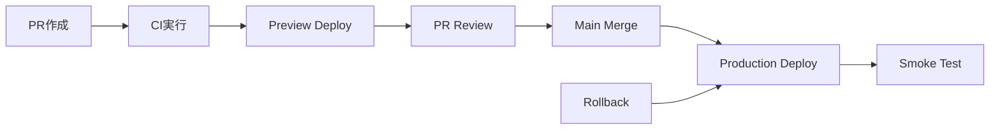

# Template Beta: Cloudflare + Supabase

Next.js（App Router）+ OpenNext + Cloudflare Workers + Supabase を使用したWebアプリケーション開発テンプレート

## 概要

このテンプレートは、モダンなWebアプリケーション開発のためのベストプラクティスを実装したプロジェクト構成です。契約駆動開発（OpenAPI-First）、層分離アーキテクチャ、型安全性を重視した設計により、保守性と拡張性の高いWebアプリケーションを構築できます。

### 主要技術スタック

- **フロントエンド**: Next.js 14 (App Router)
- **デプロイ**: OpenNext + Cloudflare Workers
- **バックエンド**: Supabase (Auth + PostgreSQL + Storage)
- **API**: OpenAPI契約駆動開発
- **型安全性**: TypeScript + Zod
- **モノレポ**: pnpm workspaces
- **テスト**: Vitest + Playwright
- **CI/CD**: GitHub Actions + Wrangler

## プロジェクト構成

```
├── apps/
│   └── web/                 # Next.js アプリケーション（UI層）
├── packages/
│   ├── core/               # ドメインロジック・ユースケース層
│   ├── bff/                # BFF（Backend for Frontend）層
│   ├── adapters/           # 外部依存アダプター層
│   └── generated/          # OpenAPIから生成される型・クライアント
├── openapi/                # OpenAPI契約定義
└── docs/                   # ドキュメント
```

## クイックスタート

### 前提条件

- Node.js 22
- pnpm 9.0.0以上
- Cloudflare アカウント
- Supabase プロジェクト

### セットアップ手順

1. **リポジトリのクローン**

```bash
git clone <your-repository-url>
cd template-beta-cloudflare-supabase
```

2. **依存関係のインストール**

```bash
pnpm install
```

3. **環境変数の設定**

```bash
cp .dev.vars.example .dev.vars
# .dev.varsファイルを編集して必要な環境変数を設定
```

4. **OpenAPI型生成**

```bash
pnpm generate
```

5. **開発サーバーの起動**

```bash
pnpm dev
```

6. **動作確認**

ブラウザで `http://localhost:3000` にアクセスして動作を確認してください。

### 詳細なセットアップ

詳細な環境設定については以下のドキュメントを参照してください：

- [環境セットアップガイド](docs/environment-setup.md)
- [GitHub セットアップガイド](docs/github-setup.md)
- [デプロイメントガイド](docs/deployment.md)

## 利用可能なコマンド

### 開発

- `pnpm dev` - 開発サーバー起動（Next.js開発サーバー + OpenAPI生成チェック）
- `pnpm dev:wrangler` - Cloudflare Workers開発サーバー起動
- `pnpm dev:monolith` - monolithモードで開発サーバー起動
- `pnpm dev:service` - serviceモードで開発サーバー起動

### ビルド

- `pnpm build` - 本番ビルド
- `pnpm build:dev` - 開発ビルド（Windows環境対応）
- `pnpm build:packages` - パッケージのみビルド

### API生成

- `pnpm generate` - OpenAPIから型・クライアント生成（mutator適用 + Prettier/ESLint 自動実行）
- `pnpm generate:check` - 生成物の同期チェック
- `pnpm openapi:lint` - OpenAPI仕様のLint
- `pnpm openapi:preview` - API仕様書のプレビュー

> **注意**: `packages/generated/`配下は生成物のため手動編集しないでください。

### 品質管理

- `pnpm lint` - 全パッケージのLint実行
- `pnpm lint:fix` - Lint自動修正
- `pnpm format` - Prettier実行
- `pnpm type-check` - 型チェック

### テスト

- `pnpm test` - 全パッケージのテスト実行
- `pnpm test:e2e` - E2Eテスト実行
- `pnpm test:perf` - パフォーマンステスト実行

### ユーティリティ

- `pnpm clean` - ビルド成果物の削除
- `pnpm check-deps` - 依存関係チェック

## 開発フロー

### 1. 機能開発の流れ

1. **要件定義**: `.kiro/specs/`で要件・設計・タスクを管理
2. **契約定義**: `openapi/openapi.yaml`でAPI契約を定義
3. **型生成**: `pnpm generate`で型安全なクライアント生成
4. **実装**: 層分離に従った実装（Core → BFF → UI）
5. **テスト**: 単体・統合・E2Eテストの実装
6. **レビュー**: PR作成とコードレビュー
7. **デプロイ**: GitHub ActionsによるCI/CD

### 2. 日常的な開発作業

```bash
# 1. 最新のコードを取得
git pull origin main

# 2. 新しいブランチを作成
git checkout -b feature/new-feature

# 3. OpenAPI契約を更新（必要に応じて）
# openapi/openapi.yaml を編集

# 4. 型とクライアントを生成
pnpm generate

# 5. 実装
# packages/core, packages/bff, apps/web で実装

# 6. テスト実行
pnpm test
pnpm test:e2e

# 7. コード品質チェック
pnpm lint
pnpm type-check

# 8. コミットとプッシュ
git add .
git commit -m "feat: add new feature"
git push origin feature/new-feature

# 9. PR作成
# GitHub上でPRを作成
```

### 3. トラブルシューティング

よくある問題と解決方法：

- **生成ファイルの同期エラー**: `pnpm generate` を実行
- **型エラー**: `pnpm type-check` で詳細確認
- **テスト失敗**: `pnpm test --reporter=verbose` で詳細確認
- **ビルドエラー**: `pnpm clean && pnpm install` で依存関係をリセット

## 層分離ルール

### 依存方向

```
UI層（apps/web） → BFF層 → Core層
                    ↓
                Adapter層
```

### 禁止事項

- UI層からCore層の直接呼び出し
- Core層からNext.jsやfetch等のimport
- Route Handlers内のビジネスロジック記述

## 環境変数管理

### 優先順位

1. CI環境変数
2. wrangler secret
3. .dev.vars（ローカル開発用）
4. process.env

### モード切替

- `BACKEND_MODE=monolith`: 同一Worker内でBFF呼び出し
- `BACKEND_MODE=service`: 外部サービス呼び出し

## CI/CD

### 自動デプロイフロー



### 環境構成

| 環境        | URL                                         | デプロイトリガー | 用途             |
| ----------- | ------------------------------------------- | ---------------- | ---------------- |
| Development | `http://localhost:3000`                     | 手動             | ローカル開発     |
| Preview     | `https://template-beta-preview.workers.dev` | PR作成・更新     | レビュー・テスト |
| Production  | `https://template-beta-prod.workers.dev`    | mainマージ       | 本番運用         |

### CI/CDワークフロー

1. **CI Pipeline**
   - OpenAPI Lint & Breaking Change検知
   - 生成ファイル同期チェック
   - ESLint & Prettier
   - TypeScript型チェック
   - 単体・統合テスト
   - ビルドテスト（monolith/service両モード）
   - セキュリティ監査

2. **Preview Deploy**
   - PR環境への自動デプロイ
   - スモークテスト実行
   - パフォーマンステスト
   - PR コメントにプレビューURL投稿

3. **Production Deploy**
   - 本番環境への自動デプロイ
   - デプロイタグ自動作成
   - ヘルスチェック実行
   - Slack通知（設定時）

4. **Rollback**
   - 手動ロールバック機能
   - 直前バージョンへの緊急復旧
   - ロールバック履歴の記録

### セットアップ手順

詳細な設定手順は以下を参照：

- [GitHub セットアップガイド](docs/github-setup.md) - リポジトリ設定とSecrets管理
- [デプロイメントガイド](docs/deployment.md) - デプロイとロールバック手順

## API仕様書

このプロジェクトはOpenAPI 3.0.3仕様に基づいてAPIを定義しています。

### API仕様書の確認

```bash
# ローカルでAPI仕様書をプレビュー
pnpm openapi:preview

# API仕様書をビルド
pnpm openapi:bundle
```

### 主要エンドポイント

- `GET /api/health` - システムヘルスチェック
- `GET /api/health/performance` - パフォーマンス統計
- `POST /auth/login` - OAuth認証開始
- `GET /auth/callback` - OAuth認証コールバック
- `POST /auth/logout` - ログアウト

詳細な仕様は `openapi/openapi.yaml` を参照してください。

## アーキテクチャ

### 層分離設計

```
┌─────────────────────────────────────────┐
│ UI層 (apps/web)                         │
│ - Next.js Pages/Components              │
│ - Route Handlers                        │
│ - Middleware                            │
└─────────────────┬───────────────────────┘
                  │
┌─────────────────▼───────────────────────┐
│ BFF層 (packages/bff)                    │
│ - API I/O変換                           │
│ - Zodバリデーション                     │
│ - エラーハンドリング                    │
└─────────────────┬───────────────────────┘
                  │
┌─────────────────▼───────────────────────┐
│ Core層 (packages/core)                  │
│ - ビジネスロジック                      │
│ - ドメインモデル                        │
│ - ユースケース                          │
└─────────────────┬───────────────────────┘
                  │
┌─────────────────▼───────────────────────┐
│ Adapter層 (packages/adapters)           │
│ - Supabase接続                          │
│ - ログ出力                              │
│ - 外部API呼び出し                       │
└─────────────────────────────────────────┘
```

### 依存関係ルール

- **UI層** → BFF層のみ呼び出し可能
- **BFF層** → Core層 + Generated層を呼び出し可能
- **Core層** → Adapter層のみ呼び出し可能
- **Adapter層** → 外部依存のみ

## パフォーマンス

### 目標値

- `/api/health` レスポンス時間: **p95 < 300ms**
- ページ読み込み時間: **LCP < 2.5s**
- バンドルサイズ: **< 500KB (gzipped)**

### 監視

```bash
# パフォーマンステスト実行
pnpm test:perf

# 本番環境でのパフォーマンス確認
curl -w "%{time_total}" -o /dev/null -s "https://your-domain.workers.dev/api/health"
```

## セキュリティ

### 実装済みセキュリティ対策

- **認証**: Supabase Auth (OAuth)
- **セッション管理**: HttpOnly Cookie
- **CSRF保護**: SameSite Cookie設定
- **ログマスキング**: PII/シークレットの自動マスク
- **入力検証**: Zodによる型安全バリデーション
- **依存関係監査**: 自動脆弱性スキャン

### セキュリティチェックリスト

- [ ] 環境変数の適切な管理
- [ ] Secrets の定期ローテーション
- [ ] 最小権限の原則
- [ ] ログ出力の機密情報マスク
- [ ] 依存関係の脆弱性監査

## ドキュメント

### 開発者向けドキュメント

#### セットアップガイド

- [環境セットアップ](docs/environment-setup.md) - 開発環境の構築手順
- [開発セットアップ](docs/development-setup.md) - 日常的な開発作業
- [GitHub セットアップ](docs/github-setup.md) - リポジトリとCI/CD設定
- [デプロイメントガイド](docs/deployment.md) - デプロイとロールバック

#### 開発ガイド

- [アーキテクチャガイド](docs/architecture-guide.md) - システム設計と層分離
- [API開発ガイド](docs/api-development.md) - OpenAPI契約駆動開発
- [テストガイド](docs/testing-guide.md) - テスト戦略と実装方法
- [タスクテンプレート](docs/task-template.md) - 開発タスクのテンプレート

### 仕様書

- [要件仕様書](.kiro/specs/template-beta-cloudflare-supabase/requirements.md)
- [設計仕様書](.kiro/specs/template-beta-cloudflare-supabase/design.md)
- [実装計画](.kiro/specs/template-beta-cloudflare-supabase/tasks.md)

## コントリビューション

1. このリポジトリをフォーク
2. 機能ブランチを作成 (`git checkout -b feature/amazing-feature`)
3. 変更をコミット (`git commit -m 'Add amazing feature'`)
4. ブランチにプッシュ (`git push origin feature/amazing-feature`)
5. Pull Requestを作成

## ライセンス

MIT License - 詳細は [LICENSE](LICENSE) ファイルを参照してください。

## サポート

- **Issues**: [GitHub Issues](https://github.com/your-username/template-beta-cloudflare-supabase/issues)
- **Discussions**: [GitHub Discussions](https://github.com/your-username/template-beta-cloudflare-supabase/discussions)
- **Documentation**: [docs/](docs/) ディレクトリ
