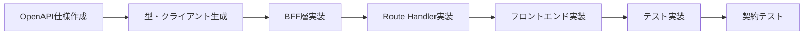

# API開発ガイド

## 概要

このドキュメントでは、OpenAPI契約駆動開発によるAPI開発の手順とベストプラクティスについて説明します。

## OpenAPI契約駆動開発

### 基本フロー



### 1. OpenAPI仕様の作成

`openapi/openapi.yaml` でAPI契約を定義します。

```yaml
paths:
  /api/example:
    get:
      summary: 例示API
      description: API の説明
      operationId: getExample
      tags:
        - Example
      responses:
        '200':
          description: 成功レスポンス
          content:
            application/json:
              schema:
                $ref: '#/components/schemas/ExampleResponse'
```

### 2. 型とクライアントの生成

```bash
# OpenAPI仕様から型とクライアントを生成
pnpm generate

# 生成されるファイル:
# - packages/generated/src/types.ts (型定義)
# - packages/generated/src/client.ts (APIクライアント)
```

### 3. BFF層の実装

`packages/bff/src/services/` でビジネスロジックを実装します。

```typescript
// packages/bff/src/services/example-service.ts
import { ExampleResponse } from '@generated/types';
import { CoreExampleService } from '@core/services';

export class ExampleService {
  constructor(private coreService: CoreExampleService) {}

  async getExample(): Promise<ExampleResponse> {
    const result = await this.coreService.processExample();
    return {
      data: result.data,
      timestamp: new Date().toISOString(),
      traceId: generateTraceId(),
    };
  }
}
```

### 4. Route Handlerの実装

`apps/web/app/api/` でHTTPエンドポイントを実装します。

```typescript
// apps/web/app/api/example/route.ts
import { NextRequest } from 'next/server';
import { ExampleService } from '@bff/services';
import { ExampleResponseSchema } from '@bff/schemas';

export async function GET(request: NextRequest) {
  try {
    const service = new ExampleService();
    const result = await service.getExample();

    // Zodバリデーション
    const validatedResult = ExampleResponseSchema.parse(result);

    return Response.json(validatedResult);
  } catch (error) {
    return handleApiError(error);
  }
}
```

## API設計ガイドライン

### 1. RESTful設計

- **リソース指向**: URLはリソースを表現
- **HTTPメソッド**: 適切なHTTPメソッドを使用
- **ステータスコード**: 適切なHTTPステータスコードを返却

```yaml
# 良い例
GET /api/users/{id}          # ユーザー取得
POST /api/users              # ユーザー作成
PUT /api/users/{id}          # ユーザー更新
DELETE /api/users/{id}       # ユーザー削除

# 悪い例
GET /api/getUser?id=123      # 動詞を含む
POST /api/users/delete       # 不適切なメソッド
```

### 2. レスポンス形式の統一

```yaml
# 成功レスポンス
components:
  schemas:
    SuccessResponse:
      type: object
      required:
        - data
        - timestamp
        - traceId
      properties:
        data:
          type: object
        timestamp:
          type: string
          format: date-time
        traceId:
          type: string

    # エラーレスポンス
    ErrorResponse:
      type: object
      required:
        - error
        - traceId
      properties:
        error:
          $ref: '#/components/schemas/ErrorDetail'
        traceId:
          type: string
```

### 3. バリデーション

入力・出力の両方でZodバリデーションを実装：

```typescript
// BFF層でのスキーマ定義
export const CreateUserRequestSchema = z.object({
  name: z.string().min(1).max(100),
  email: z.string().email(),
  age: z.number().int().min(0).max(150).optional(),
});

export const UserResponseSchema = z.object({
  id: z.string().uuid(),
  name: z.string(),
  email: z.string().email(),
  createdAt: z.string().datetime(),
  traceId: z.string(),
});
```

## エラーハンドリング

### 1. エラー分類

```typescript
// packages/bff/src/errors/api-errors.ts
export class ValidationError extends Error {
  constructor(
    message: string,
    public details?: any
  ) {
    super(message);
    this.name = 'ValidationError';
  }
}

export class NotFoundError extends Error {
  constructor(resource: string, id: string) {
    super(`${resource} with id ${id} not found`);
    this.name = 'NotFoundError';
  }
}

export class ConflictError extends Error {
  constructor(message: string) {
    super(message);
    this.name = 'ConflictError';
  }
}
```

### 2. エラーハンドラー

```typescript
// apps/web/lib/api-error-handler.ts
export function handleApiError(error: unknown): Response {
  const traceId = generateTraceId();

  if (error instanceof ValidationError) {
    return Response.json(
      {
        error: {
          code: 'VALIDATION_ERROR',
          message: error.message,
          details: error.details,
        },
        traceId,
      },
      { status: 422 }
    );
  }

  if (error instanceof NotFoundError) {
    return Response.json(
      {
        error: {
          code: 'NOT_FOUND',
          message: error.message,
        },
        traceId,
      },
      { status: 404 }
    );
  }

  // システムエラー
  logger.error({ error, traceId }, 'Unhandled API error');
  return Response.json(
    {
      error: {
        code: 'INTERNAL_SERVER_ERROR',
        message: 'Internal server error',
      },
      traceId,
    },
    { status: 500 }
  );
}
```

## テスト戦略

### 1. 契約テスト

OpenAPI仕様との整合性をテスト：

```typescript
// apps/web/__tests__/api/contract.test.ts
import { describe, it, expect } from 'vitest';
import { ExampleResponseSchema } from '@bff/schemas';

describe('API Contract Tests', () => {
  it('should return valid response format', async () => {
    const response = await fetch('/api/example');
    const data = await response.json();

    // OpenAPI仕様との整合性チェック
    expect(() => ExampleResponseSchema.parse(data)).not.toThrow();
    expect(response.status).toBe(200);
  });
});
```

### 2. BFF層テスト

```typescript
// packages/bff/__tests__/services/example-service.test.ts
import { describe, it, expect, vi } from 'vitest';
import { ExampleService } from '../src/services/example-service';

describe('ExampleService', () => {
  it('should return formatted response', async () => {
    const mockCoreService = {
      processExample: vi.fn().mockResolvedValue({ data: 'test' }),
    };

    const service = new ExampleService(mockCoreService);
    const result = await service.getExample();

    expect(result).toMatchObject({
      data: 'test',
      timestamp: expect.any(String),
      traceId: expect.any(String),
    });
  });
});
```

### 3. E2Eテスト

```typescript
// apps/web/e2e/api/example.spec.ts
import { test, expect } from '@playwright/test';

test('Example API E2E', async ({ request }) => {
  const response = await request.get('/api/example');

  expect(response.status()).toBe(200);

  const data = await response.json();
  expect(data).toHaveProperty('data');
  expect(data).toHaveProperty('timestamp');
  expect(data).toHaveProperty('traceId');
});
```

## パフォーマンス最適化

### 1. レスポンス時間の目標

- **ヘルスチェック**: p95 < 300ms
- **データ取得API**: p95 < 500ms
- **データ更新API**: p95 < 1000ms

### 2. 最適化手法

```typescript
// キャッシュの実装例
export class CachedExampleService {
  private cache = new Map<string, { data: any; expiry: number }>();

  async getExample(id: string): Promise<ExampleResponse> {
    const cacheKey = `example:${id}`;
    const cached = this.cache.get(cacheKey);

    if (cached && cached.expiry > Date.now()) {
      return cached.data;
    }

    const result = await this.coreService.getExample(id);

    // 5分間キャッシュ
    this.cache.set(cacheKey, {
      data: result,
      expiry: Date.now() + 5 * 60 * 1000,
    });

    return result;
  }
}
```

### 3. パフォーマンス監視

```typescript
// パフォーマンス測定の実装
export function withPerformanceMonitoring<T>(
  operation: string,
  fn: () => Promise<T>
): Promise<T> {
  return performanceMonitor.measure(operation, fn);
}

// 使用例
export async function GET() {
  return withPerformanceMonitoring('api-example-get', async () => {
    const service = new ExampleService();
    return service.getExample();
  });
}
```

## セキュリティ考慮事項

### 1. 入力検証

```typescript
// 厳密な入力検証
export const CreateUserSchema = z.object({
  name: z
    .string()
    .min(1, 'Name is required')
    .max(100, 'Name must be less than 100 characters')
    .regex(/^[a-zA-Z0-9\s]+$/, 'Name contains invalid characters'),
  email: z
    .string()
    .email('Invalid email format')
    .max(255, 'Email must be less than 255 characters'),
});
```

### 2. 認証・認可

```typescript
// 認証が必要なAPIの実装
export async function GET(request: NextRequest) {
  const session = await getSession(request);

  if (!session) {
    return Response.json(
      { error: { code: 'UNAUTHORIZED', message: 'Authentication required' } },
      { status: 401 }
    );
  }

  // 認可チェック
  if (!hasPermission(session.user, 'read:examples')) {
    return Response.json(
      { error: { code: 'FORBIDDEN', message: 'Insufficient permissions' } },
      { status: 403 }
    );
  }

  // API処理
}
```

### 3. ログ出力

```typescript
// 機密情報のマスキング
const logger = pino({
  redact: {
    paths: ['password', 'token', 'secret', 'authorization'],
    censor: '[REDACTED]',
  },
});

// 構造化ログ
logger.info(
  {
    operation: 'api-example-get',
    userId: session.user.id,
    traceId,
    duration: 150,
  },
  'API request completed'
);
```

## ベストプラクティス

### 1. API設計

- **一貫性**: 命名規則とレスポンス形式を統一
- **バージョニング**: 破壊的変更時はバージョンを分ける
- **ドキュメント**: OpenAPI仕様を常に最新に保つ
- **テスト**: 契約テストで仕様との整合性を保証

### 2. 実装

- **層分離**: 責務を明確に分離
- **エラーハンドリング**: 適切なエラー分類と処理
- **バリデーション**: 入力・出力の両方で検証
- **ログ**: 構造化ログでトレーサビリティを確保

### 3. 運用

- **監視**: パフォーマンスとエラー率を監視
- **アラート**: 異常時の自動通知
- **ロールバック**: 問題発生時の迅速な復旧
- **ドキュメント**: 運用手順の文書化

## 参考リンク

- [OpenAPI Specification](https://swagger.io/specification/)
- [Zod Documentation](https://zod.dev/)
- [Next.js API Routes](https://nextjs.org/docs/app/building-your-application/routing/route-handlers)
- [Redocly CLI](https://redocly.com/docs/cli/)
