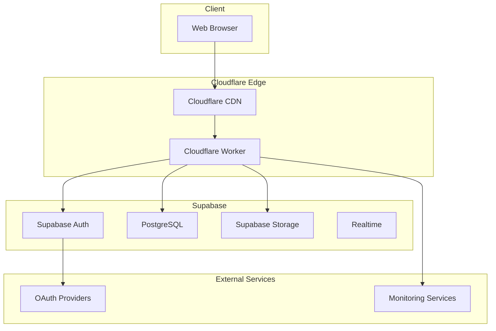
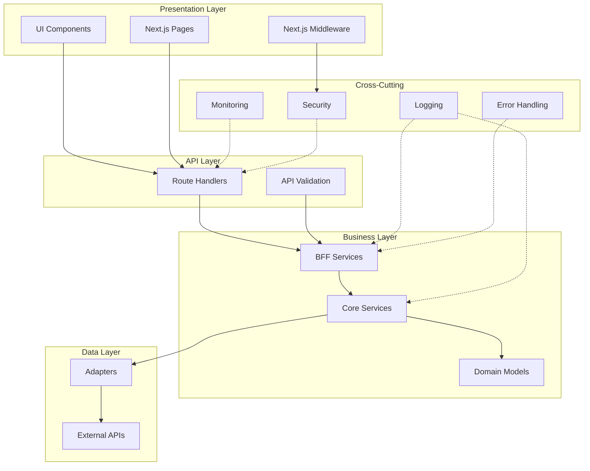
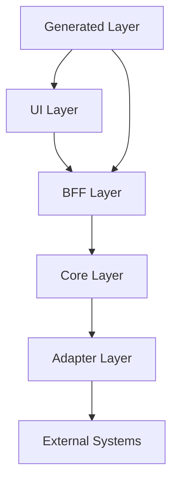

# アーキテクチャガイド

## 概要

このドキュメントでは、Template Beta プロジェクトのアーキテクチャ設計、層分離の原則、および拡張性を考慮した設計パターンについて説明します。

## アーキテクチャ概要

### システム全体構成



### 論理アーキテクチャ



## 層分離設計

### 1. UI層 (apps/web)

**責務**: ユーザーインターフェース、ルーティング、認証制御

```typescript
// 構成例
apps/web/
├── app/
│   ├── (auth)/          # 認証関連ページ
│   ├── api/             # Route Handlers
│   ├── globals.css      # グローバルスタイル
│   ├── layout.tsx       # ルートレイアウト
│   └── page.tsx         # トップページ
├── components/          # 再利用可能コンポーネント
├── lib/                 # UI層専用ユーティリティ
└── middleware.ts        # Next.js ミドルウェア
```

**設計原則**:

- BFF層のみを呼び出し、Core層を直接呼び出さない
- UIロジックとビジネスロジックを分離
- 認証・認可はミドルウェアで一元管理

```typescript
// 良い例: BFF層経由でのAPI呼び出し
export default function HealthPage() {
  const { data, error } = useSWR('/api/health', fetcher);

  if (error) return <ErrorDisplay error={error} />;
  if (!data) return <LoadingSpinner />;

  return <HealthDisplay data={data} />;
}

// 悪い例: Core層の直接呼び出し
import { CoreHealthService } from '@core/services'; // ❌ 禁止
```

### 2. BFF層 (packages/bff)

**責務**: API入出力変換、バリデーション、エラーハンドリング

```typescript
// 構成例
packages/bff/
├── src/
│   ├── services/        # BFFサービス
│   ├── schemas/         # Zodバリデーションスキーマ
│   ├── errors/          # エラー定義
│   └── utils/           # BFF層ユーティリティ
└── __tests__/           # BFF層テスト
```

**設計原則**:

- OpenAPI契約とCore層の橋渡し
- 入出力の型安全性を保証
- トレースIDの管理

```typescript
// BFFサービスの実装例
export class HealthService {
  constructor(
    private coreHealthService: CoreHealthService,
    private logger: Logger
  ) {}

  async checkHealth(): Promise<HealthResponse> {
    const traceId = generateTraceId();
    const childLogger = this.logger.child({ traceId });

    try {
      childLogger.info('Health check started');

      const coreResult = await this.coreHealthService.performHealthCheck();

      // Core層の結果をAPI形式に変換
      const response: HealthResponse = {
        status: coreResult.status,
        timestamp: coreResult.timestamp.toISOString(),
        services: coreResult.services,
        traceId,
      };

      // Zodバリデーション
      return HealthResponseSchema.parse(response);
    } catch (error) {
      childLogger.error({ error }, 'Health check failed');
      throw error;
    }
  }
}
```

### 3. Core層 (packages/core)

**責務**: ビジネスロジック、ドメインモデル、ユースケース

```typescript
// 構成例
packages/core/
├── src/
│   ├── models/          # ドメインモデル
│   ├── services/        # ビジネスサービス
│   ├── interfaces/      # インターフェース定義
│   └── types/           # Core層型定義
└── __tests__/           # Core層テスト
```

**設計原則**:

- 外部依存を持たない純粋なビジネスロジック
- ドメイン駆動設計の原則に従う
- インターフェースによる依存性の逆転

```typescript
// ドメインモデルの例
export interface HealthStatus {
  status: 'healthy' | 'degraded' | 'unhealthy';
  timestamp: Date;
  services: ServiceHealth[];
}

export interface ServiceHealth {
  name: string;
  status: 'up' | 'down';
  responseTime?: number;
  error?: string;
}

// ビジネスサービスの例
export class CoreHealthService {
  constructor(
    private adapters: {
      supabase: SupabaseAdapter;
      logger: Logger;
    }
  ) {}

  async performHealthCheck(): Promise<HealthStatus> {
    const services: ServiceHealth[] = [];

    // Supabase接続チェック
    const supabaseHealth = await this.checkSupabaseHealth();
    services.push(supabaseHealth);

    return {
      status: this.determineOverallStatus(services),
      timestamp: new Date(),
      services,
    };
  }

  private determineOverallStatus(
    services: ServiceHealth[]
  ): HealthStatus['status'] {
    const downServices = services.filter(s => s.status === 'down');

    if (downServices.length === 0) return 'healthy';
    if (downServices.length === services.length) return 'unhealthy';
    return 'degraded';
  }
}
```

### 4. Adapter層 (packages/adapters)

**責務**: 外部システムとの接続、インフラストラクチャ関連

```typescript
// 構成例
packages/adapters/
├── src/
│   ├── supabase/        # Supabase接続
│   ├── logger/          # ログ出力
│   ├── performance/     # パフォーマンス監視
│   └── config/          # 設定管理
└── __tests__/           # Adapter層テスト
```

**設計原則**:

- 外部依存の抽象化
- 設定による動作切替
- エラーハンドリングの統一

```typescript
// Adapterの実装例
export class SupabaseAdapter {
  private client: SupabaseClient;

  constructor(private config: SupabaseConfig) {
    this.client = createClient(config.url, config.anonKey);
  }

  async checkConnection(): Promise<boolean> {
    try {
      const { error } = await this.client
        .from('health_check')
        .select('1')
        .limit(1);

      return !error;
    } catch (error) {
      this.config.logger?.error({ error }, 'Supabase connection check failed');
      return false;
    }
  }

  async signInWithOAuth(params: OAuthParams): Promise<AuthResponse> {
    return this.client.auth.signInWithOAuth(params);
  }
}
```

## 依存関係管理

### 依存方向の原則



### 依存性注入

```typescript
// 依存性注入の実装例
export class ServiceContainer {
  private static instance: ServiceContainer;

  private constructor(
    private config: AppConfig,
    private adapters: AdapterContainer
  ) {}

  static create(config: AppConfig): ServiceContainer {
    if (!ServiceContainer.instance) {
      const adapters = new AdapterContainer(config);
      ServiceContainer.instance = new ServiceContainer(config, adapters);
    }
    return ServiceContainer.instance;
  }

  createHealthService(): HealthService {
    const coreService = new CoreHealthService({
      supabase: this.adapters.supabase,
      logger: this.adapters.logger,
    });

    return new HealthService(coreService, this.adapters.logger);
  }
}
```

## 設計パターン

### 1. Repository パターン

```typescript
// リポジトリインターフェース
export interface UserRepository {
  findById(id: string): Promise<User | null>;
  save(user: User): Promise<void>;
  delete(id: string): Promise<void>;
}

// Supabase実装
export class SupabaseUserRepository implements UserRepository {
  constructor(private client: SupabaseClient) {}

  async findById(id: string): Promise<User | null> {
    const { data, error } = await this.client
      .from('users')
      .select('*')
      .eq('id', id)
      .single();

    if (error || !data) return null;
    return this.mapToUser(data);
  }
}
```

### 2. Factory パターン

```typescript
// サービスファクトリー
export class ServiceFactory {
  static createHealthService(config: AppConfig): HealthService {
    const adapters = AdapterFactory.createAdapters(config);
    const coreService = new CoreHealthService(adapters);
    return new HealthService(coreService, adapters.logger);
  }
}
```

### 3. Strategy パターン

```typescript
// 認証戦略
export interface AuthStrategy {
  authenticate(credentials: any): Promise<AuthResult>;
}

export class OAuthStrategy implements AuthStrategy {
  async authenticate(credentials: OAuthCredentials): Promise<AuthResult> {
    // OAuth認証の実装
  }
}

export class AuthService {
  constructor(private strategy: AuthStrategy) {}

  async login(credentials: any): Promise<AuthResult> {
    return this.strategy.authenticate(credentials);
  }
}
```

## エラーハンドリング設計

### エラー階層

```typescript
// ベースエラークラス
export abstract class AppError extends Error {
  abstract readonly code: string;
  abstract readonly statusCode: number;

  constructor(
    message: string,
    public readonly context?: Record<string, any>
  ) {
    super(message);
    this.name = this.constructor.name;
  }
}

// 具体的なエラークラス
export class ValidationError extends AppError {
  readonly code = 'VALIDATION_ERROR';
  readonly statusCode = 422;
}

export class NotFoundError extends AppError {
  readonly code = 'NOT_FOUND';
  readonly statusCode = 404;
}

export class InternalServerError extends AppError {
  readonly code = 'INTERNAL_SERVER_ERROR';
  readonly statusCode = 500;
}
```

### エラーハンドリングミドルウェア

```typescript
export function createErrorHandler(logger: Logger) {
  return (error: unknown, context: ErrorContext): ErrorResponse => {
    const traceId = context.traceId || generateTraceId();

    if (error instanceof AppError) {
      logger.warn({ error: error.message, context: error.context, traceId });
      return {
        status: error.statusCode,
        body: {
          error: {
            code: error.code,
            message: error.message,
          },
          traceId,
        },
      };
    }

    // 予期しないエラー
    logger.error({ error, traceId }, 'Unhandled error');
    return {
      status: 500,
      body: {
        error: {
          code: 'INTERNAL_SERVER_ERROR',
          message: 'Internal server error',
        },
        traceId,
      },
    };
  };
}
```

## パフォーマンス設計

### キャッシュ戦略

```typescript
// キャッシュインターフェース
export interface CacheAdapter {
  get<T>(key: string): Promise<T | null>;
  set<T>(key: string, value: T, ttl?: number): Promise<void>;
  delete(key: string): Promise<void>;
}

// メモリキャッシュ実装
export class MemoryCacheAdapter implements CacheAdapter {
  private cache = new Map<string, { value: any; expiry: number }>();

  async get<T>(key: string): Promise<T | null> {
    const item = this.cache.get(key);
    if (!item || item.expiry < Date.now()) {
      this.cache.delete(key);
      return null;
    }
    return item.value;
  }

  async set<T>(key: string, value: T, ttl = 300000): Promise<void> {
    this.cache.set(key, {
      value,
      expiry: Date.now() + ttl,
    });
  }
}
```

### パフォーマンス監視

```typescript
export class PerformanceMonitor {
  private stats = new Map<string, OperationStats>();

  async measure<T>(operation: string, fn: () => Promise<T>): Promise<T> {
    const startTime = performance.now();

    try {
      const result = await fn();
      this.recordSuccess(operation, performance.now() - startTime);
      return result;
    } catch (error) {
      this.recordError(operation, performance.now() - startTime);
      throw error;
    }
  }

  private recordSuccess(operation: string, duration: number): void {
    const stats = this.getOrCreateStats(operation);
    stats.totalCount++;
    stats.successCount++;
    stats.durations.push(duration);
  }
}
```

## セキュリティ設計

### 認証・認可

```typescript
// 認証ミドルウェア
export async function authMiddleware(request: NextRequest) {
  const { supabase, response } = createServerClient(request);

  const {
    data: { session },
  } = await supabase.auth.getSession();

  // 認証が必要なパスの保護
  if (isProtectedPath(request.nextUrl.pathname) && !session) {
    return NextResponse.redirect(new URL('/', request.url));
  }

  return response;
}

// 認可チェック
export function requirePermission(permission: string) {
  return (
    target: any,
    propertyName: string,
    descriptor: PropertyDescriptor
  ) => {
    const method = descriptor.value;

    descriptor.value = async function (...args: any[]) {
      const session = getCurrentSession();

      if (!hasPermission(session.user, permission)) {
        throw new ForbiddenError(`Permission ${permission} required`);
      }

      return method.apply(this, args);
    };
  };
}
```

### データ保護

```typescript
// PII マスキング
export const pinoConfig = {
  redact: {
    paths: [
      'password',
      'token',
      'secret',
      'authorization',
      'cookie',
      'email',
      'phone',
    ],
    censor: '[REDACTED]',
  },
};

// 入力サニタイゼーション
export const sanitizeInput = (input: string): string => {
  return input
    .replace(/<script\b[^<]*(?:(?!<\/script>)<[^<]*)*<\/script>/gi, '')
    .replace(/javascript:/gi, '')
    .trim();
};
```

## 拡張性設計

### プラグインアーキテクチャ

```typescript
// プラグインインターフェース
export interface Plugin {
  name: string;
  version: string;
  initialize(context: PluginContext): Promise<void>;
  destroy(): Promise<void>;
}

// プラグインマネージャー
export class PluginManager {
  private plugins = new Map<string, Plugin>();

  async loadPlugin(plugin: Plugin): Promise<void> {
    await plugin.initialize(this.createContext());
    this.plugins.set(plugin.name, plugin);
  }

  async unloadPlugin(name: string): Promise<void> {
    const plugin = this.plugins.get(name);
    if (plugin) {
      await plugin.destroy();
      this.plugins.delete(name);
    }
  }
}
```

### 設定管理

```typescript
// 環境別設定
export interface AppConfig {
  environment: 'development' | 'preview' | 'production';
  backendMode: 'monolith' | 'service';
  supabase: SupabaseConfig;
  logging: LoggingConfig;
  performance: PerformanceConfig;
}

// 設定ファクトリー
export class ConfigFactory {
  static create(): AppConfig {
    return {
      environment: getEnv('NODE_ENV', 'development'),
      backendMode: getEnv('BACKEND_MODE', 'monolith'),
      supabase: {
        url: getEnv('SUPABASE_URL'),
        anonKey: getEnv('SUPABASE_ANON_KEY'),
        serviceRoleKey: getEnv('SUPABASE_SERVICE_ROLE_KEY'),
      },
      // ...
    };
  }
}
```

## 将来拡張への対応

### マイクロサービス分離

```typescript
// サービス境界の定義
export interface ServiceBoundary {
  name: string;
  endpoints: string[];
  dependencies: string[];
}

// サービス分離戦略
export class ServiceSeparationStrategy {
  async separateService(boundary: ServiceBoundary): Promise<void> {
    // 1. 依存関係の分析
    // 2. データベース分離
    // 3. API境界の確立
    // 4. 段階的移行
  }
}
```

### クラウド移行対応

```typescript
// クラウドプロバイダー抽象化
export interface CloudProvider {
  deployFunction(code: string, config: DeployConfig): Promise<string>;
  createDatabase(config: DatabaseConfig): Promise<string>;
  setupCDN(config: CDNConfig): Promise<string>;
}

// マルチクラウド対応
export class MultiCloudDeployer {
  constructor(private providers: Map<string, CloudProvider>) {}

  async deploy(target: string, config: DeploymentConfig): Promise<void> {
    const provider = this.providers.get(target);
    if (!provider) {
      throw new Error(`Provider ${target} not found`);
    }

    await provider.deployFunction(config.code, config.deploy);
  }
}
```

## 参考リンク

- [Clean Architecture](https://blog.cleancoder.com/uncle-bob/2012/08/13/the-clean-architecture.html)
- [Domain-Driven Design](https://martinfowler.com/bliki/DomainDrivenDesign.html)
- [Hexagonal Architecture](https://alistair.cockburn.us/hexagonal-architecture/)
- [SOLID Principles](https://en.wikipedia.org/wiki/SOLID)
